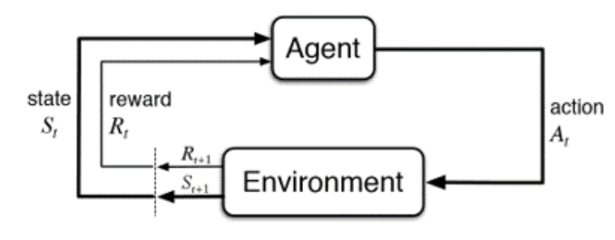
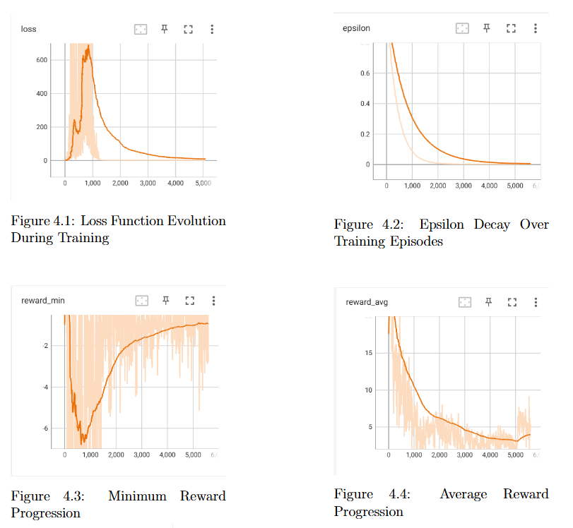
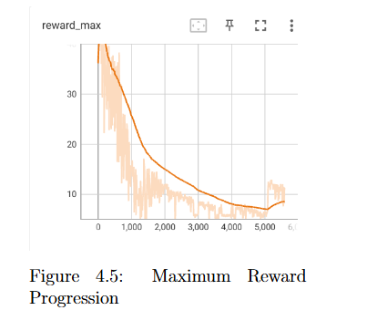

# deep-rl-autonomous-vehicle-safety
Deep Reinforcement Learning project for autonomous vehicle safety using DQN in the CARLA simulator.

📌 Overview

Autonomous driving is evolving rapidly with advances in AI and sensor systems, but **safety in dynamic environments** remains a major challenge.
Traditional supervised learning approaches require large labeled datasets and fail to generalize to **dangerous or rare safety-critical scenarios**.

This project implements **Deep Reinforcement Learning (DRL)** — specifically a **Deep Q-Network (DQN)** using **TensorFlow/Keras** — to train an autonomous driving agent inside the CARLA simulator.

The agent learns safe behavior (collision avoidance, speed control) by interacting with the environment and receiving reward signals.

## 🎯 Objectives

- Apply **Deep Reinforcement Learning (DRL)** — specifically the **DQN algorithm** — to improve autonomous vehicle decision-making.  
- Use the **CARLA simulator** to recreate complex and dynamic driving environments.  
- Develop a model capable of optimizing navigation while **reducing collision risks** across diverse scenarios.  
- Evaluate the agent’s performance and **compare it with existing state-of-the-art models**.
- Analyze limitations and propose future improvements  

## 1.  RL Overview
Unlike supervised or unsupervised learning, RL **does not require pre-collected data**. The agent generates data through interactions, learning by **trial and error** with **rewards** guiding its behavior.

**Key concepts:**
- **Agent:** Learns from environment interactions by observing states, taking actions, and receiving rewards.
- **Environment:** Where the agent acts and receives feedback.
- **State:** The current situation of the agent in the environment.
- **Reward:** Numerical feedback for each action, guiding learning.

  
   
  <em>Figure 1: Agent-Environment Interaction in Reinforcement learnin</em>
  

## 2. Results

The experiments were conducted on a high-performance machine equipped with an Intel Core i9 processor, NVIDIA RTX 4090 GPU, and 32 GB RAM. The DQN agent was trained for 5,000 episodes, and performance was monitored using TensorBoard.

Loss Curve:
The loss represents the difference between predicted and target Q-values. A decreasing trend indicates that the model is learning effectively and improving its predictions (see Figure 4.1).

Exploration Rate (Epsilon):
The epsilon value decreases over time (Figure 4.2), which is expected behavior. The agent initially explores the environment and gradually shifts toward exploitation of learned strategies.

Minimum Reward (reward_min):
An increasing trend (Figure 4.3) suggests that the agent is avoiding poor decisions and reducing critical errors.

Average Reward (reward_avg):
A decreasing trend (Figure 4.4) indicates that the agent may converge toward a sub-optimal strategy, highlighting potential issues in the learning process.

Maximum Reward (reward_max):
The observed decrease (Figure 4.5) suggests that the agent is no longer achieving its best possible performance. This is likely due to the reward design, where penalties are applied for collisions, but no positive reward is given for successful avoidance.

  
   

 
   

## 3. Limitations

- Limited training time and computational resources

- Simulation-to-real-world gap

- Sensitivity to reward design

- Lane-keeping issue: The agent does not consistently maintain its position within the driving lane, indicating that it has not fully learned stable lateral control.

## 4. Future work
- Add an obstacle detector and a lane crossing detection system.
- Increase the complexity of the environment, by integrating elements such as traffic, pedestrians, cyclists and varied weather conditions. 
- Use sensor fusion, such as camera and LiDAR, applying algorithms such as NCNN to improve detection accuracy.
- Evaluate modeling in various maps vicii c est que j ai propser dans mon rapport.
